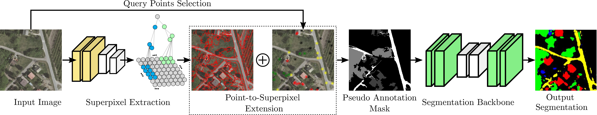

# Learning Semantic Segmentation with Query Points Supervision (LSSQPS)



> **Learning Semantic Segmentation with Query Points Supervision**<br>
> [Santiago Rivier](https://www.linkedin.com/in/santiago-rivier/), [Carlos Hinojosa](https://carloshinojosa.me/), [Silvio Giancola](https://www.silviogiancola.com/)\*, [Bernard Ghanem](https://www.bernardghanem.com/)\*
> In ICIP 2024.

> Paper: TODO<br>

> **Abstract:** *Semantic segmentation is crucial in remote sensing, where high-resolution satellite images are segmented into meaningful regions. Recent advancements in deep learning have significantly improved satellite image segmentation.
> However, most of these methods are typically trained in fully supervised settings that require high-quality pixel-level annotations, which are expensive and time-consuming to obtain.
> In this work, we present a weakly supervised learning algorithm to train semantic segmentation algorithms that only rely on query point annotations instead of full mask labels. Our proposed approach performs accurate semantic segmentation and improves efficiency by significantly reducing the cost and time required for manual annotation.
> Specifically, we generate superpixels and extend the query point labels into those superpixels that group similar meaningful semantics. Then, we train semantic segmentation models supervised with images partially labeled with the superpixel pseudo-labels.
> We benchmark our weakly supervised training approach on an aerial image dataset and different semantic segmentation architectures, showing that we can reach competitive performance compared to fully supervised training while reducing the annotation effort.*

## Software installation

Clone this repository:

```
git clone https://github.com/santiago2205/LSSQPS.git
cd LSSQPS/
```

Create a virtual environment and install the requirements:

```
python3 -m venv venv
source venv/bin/activate
pip install -r requirements.txt
```

## Preprocess

### DAL-HERS Model set-up
Download the pretrained Deep Affinity Learning (DAL) model from [here](https://drive.google.com/file/d/1Y_yXJGu361hucwENxwXHq5Ad4hdJinO6/view?usp=sharing) and place it under the `DAL-HERS/pretrained` folder.

### LandCoverAI dataset set-up:

Download the dataset with the following command:
```
wget -P src/Preprocess https://landcover.ai.linuxpolska.com/download/landcover.ai.v1.zip
```

Alternatively, you can use curl:
```
# curl -o src/Preprocess/landcover.ai.v1.zip https://landcover.ai.linuxpolska.com/download/landcover.ai.v1.zip
```

Unzip the compressed file and run the `split.py` script to get the images:
```
unzip src/Preprocess/landcover.ai.v1.zip -d src/Preprocess
python3 src/Preprocess/split.py
```

Preprocess the images with the following program. This program will generate a `Dataset` folder in the `NN` folder. If you wish to select another path, add the parameter `--path_dataset_nn` in the code. The parameters `--nC` and `--nP` represent the number of superpixels and the number of points used to select superpixels randomly, respectively.

```
python3 src/Preprocess/LandCoverAI/dataset_torchgeo.py
```

## Train DeepLabV3
Use the following command to train the DeepLabV3 with the LandcoverAI dataset. The `--output_directory` parameter is the only mandatory one.

```
python src/NN/main.py --output_directory src/NN/train_output/000_Test
```
Additional parameters:
* `--data_directory`: Directory of the dataset
* `--output_directory`: Directory of the DeepLabV3 output
* `--train_percent`: Percentage of image train used to train (0.1 - 1)
* `--num_class`: Specify number of class, default 4 (LandCoverAI)."
* `--epochs`: Number of epoch
* `--batch_size`: Batch size used to train
* `--models`: Specify the model (`'DeepLabV3Rn50', 'DeepLabV3Rn101', 'FCNetRn50', 'FCNetRn101', 'UNet'`)


## Inference
Run the following command to perform inference:
```
python src/Inference/inference.py --output_directory src/NN/train_output/000_Test
```
* `--data_directory`: Directory of the output of the NN
* `--output_directory`: Directory of the DeepLabV3 output

## License
This work is distributed under the MIT License. See `LICENSE` for more information.

## Citation
If you find this work useful for your research, please cite our paper:

```
@article{rivier2024learning,
  title={Learning Semantic Segmentation with Query Points Supervision},
  author={Rivier, Santiago and Hinojosa, Carlos and Giancola, Silvio and Ghanem, Bernard},
  journal={arXiv preprint TODO},
  year={2024}
}
```

## Acknowledgements
- This work was supported by the King Abdullah University of Science and Technology (KAUST).
